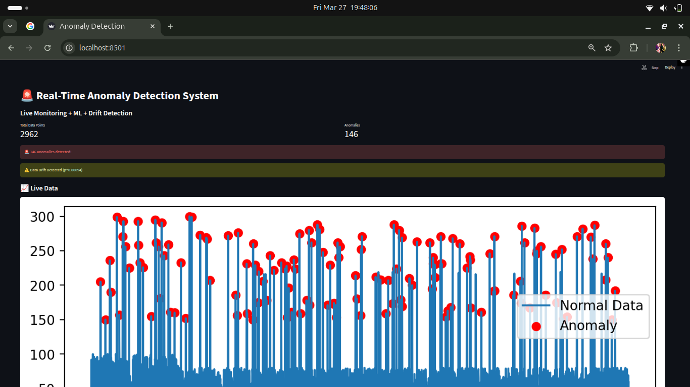
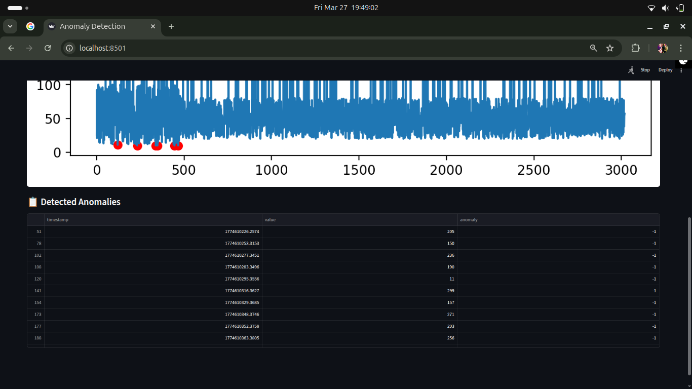
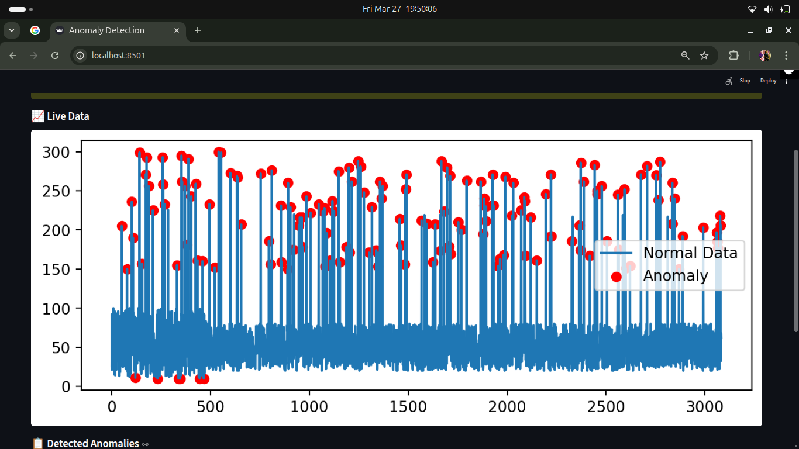
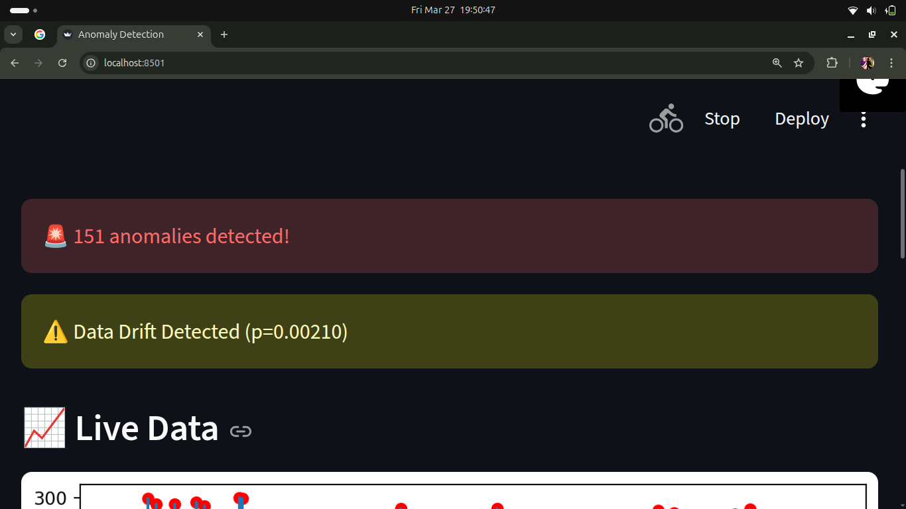

# 🚨 Real-Time Anomaly Detection & Data Drift Monitoring System

## 👩‍💻 Author

**Aishwarya Priydarshni**
Final Year B.Tech (CSE - Data Science)
Aspiring Machine Learning Engineer

* 🔗 GitHub: https://github.com/Aishwaryap015
* 🔗 LinkedIn: https://www.linkedin.com/in/aishwarya-priydarshni

---

## 📌 Overview

In real-world machine learning systems, incoming data continuously changes over time.
If these changes are not monitored, models can become unreliable and produce incorrect predictions.

This project implements a **real-time anomaly detection and data drift monitoring system** that:

* Detects abnormal data points (anomalies)
* Identifies changes in data distribution (drift)
* Visualizes everything using a live dashboard

The system simulates streaming data and demonstrates how ML models are monitored in production environments.

---

## 🎯 Problem Statement

In domains such as finance, healthcare, and system monitoring, unexpected patterns in data can:

* Reduce model performance
* Indicate system failures or fraud
* Lead to incorrect decisions

This project addresses these challenges by:

* Continuously monitoring incoming data
* Detecting anomalies using machine learning
* Identifying data drift using statistical methods
* Providing real-time alerts and visualization

---

## 🧠 Key Features

* 📊 Real-time data streaming simulation
* 🤖 Anomaly detection using Isolation Forest
* ⚠️ Data drift detection using KS Test (Kolmogorov–Smirnov Test)
* 📈 Interactive dashboard using Streamlit
* 🚨 Alert system for anomalies and drift
* 🔴 Visual highlighting of anomalies
* 📊 Real-time metrics display

---

## 🏗️ System Workflow

Data Generation → Anomaly Detection → Drift Detection → Dashboard Visualization → Alerts

---

## 📂 Project Structure

```
real_time_anomaly_detection/
│
├── app.py                # Streamlit dashboard
├── model.py              # Anomaly detection logic
├── drift.py              # Data drift detection
├── generate_data.py      # Real-time data simulation
├── data.csv              # Streaming data
├── requirements.txt
└── screenshots/          # Project screenshots
```

---

## ⚙️ Tech Stack

* **Language:** Python
* **Libraries:** Pandas, NumPy, Scikit-learn, SciPy
* **Visualization:** Matplotlib
* **Dashboard:** Streamlit
* **Version Control:** Git & GitHub

---

## ▶️ How to Run

### 1. Install dependencies

```
pip install -r requirements.txt
```

### 2. Run data generator (Terminal 1)

```
python generate_data.py
```

### 3. Run dashboard (Terminal 2)

```
streamlit run app.py
```

---

## 📸 Dashboard Preview

### 🔹 Top Section (Metrics + Alerts)



### 🔹 Bottom Section (Graph + Table)



---

## 🔍 Key Functionalities

### 🔴 Anomaly Detection

* Detects unusual data points using Isolation Forest
* Highlights anomalies directly on the graph



---

### ⚠️ Data Drift Detection

* Uses KS-Test to compare historical vs recent data
* Detects distribution changes and triggers alerts



---

## 📈 Output & Functionality

* Real-time monitoring of streaming data
* Detection of abnormal patterns
* Statistical drift detection
* Visual alerts and metrics
* Interactive dashboard

---

## 💡 Use Cases

* Fraud detection systems
* System and server monitoring
* Financial anomaly detection
* IoT sensor monitoring
* ML model monitoring

---

## 🚀 Future Improvements

* 📩 Email/SMS alert system
* 🔄 Automated model retraining
* 📊 Multi-feature anomaly detection
* ☁️ Cloud deployment (AWS/GCP)
* 🔗 Kafka integration for real-time streaming

---

## ⭐ Key Highlights

* Built a real-time ML monitoring system
* Applied unsupervised learning for anomaly detection
* Implemented statistical drift detection
* Designed an interactive dashboard
* Worked through real-world deployment challenges

---

## 🎤 Interview Explanation

“I developed a real-time anomaly detection and data drift monitoring system using Isolation Forest and KS-Test. The system simulates streaming data, detects anomalies, monitors distribution changes, and visualizes everything through a Streamlit dashboard with real-time alerts.”

---

## 📌 Conclusion

This project demonstrates practical understanding of:

* Real-time data processing
* Machine learning monitoring systems
* Statistical analysis
* Dashboard development

Relevant for roles in:

* Machine Learning Engineering
* Data Science
* MLOps

---

## 📜 License

This project is for educational purposes.
